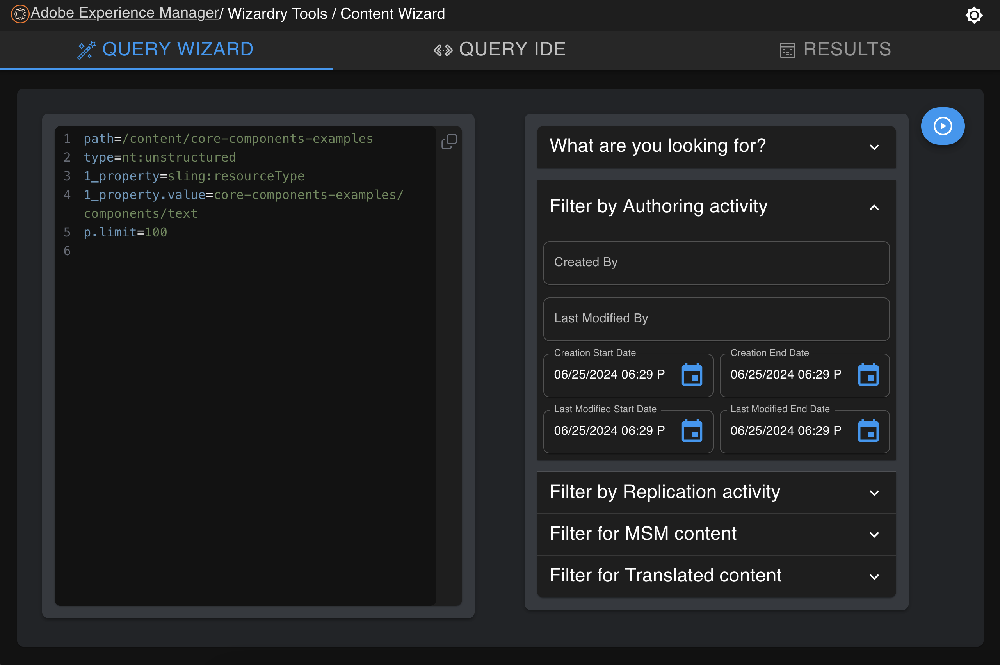
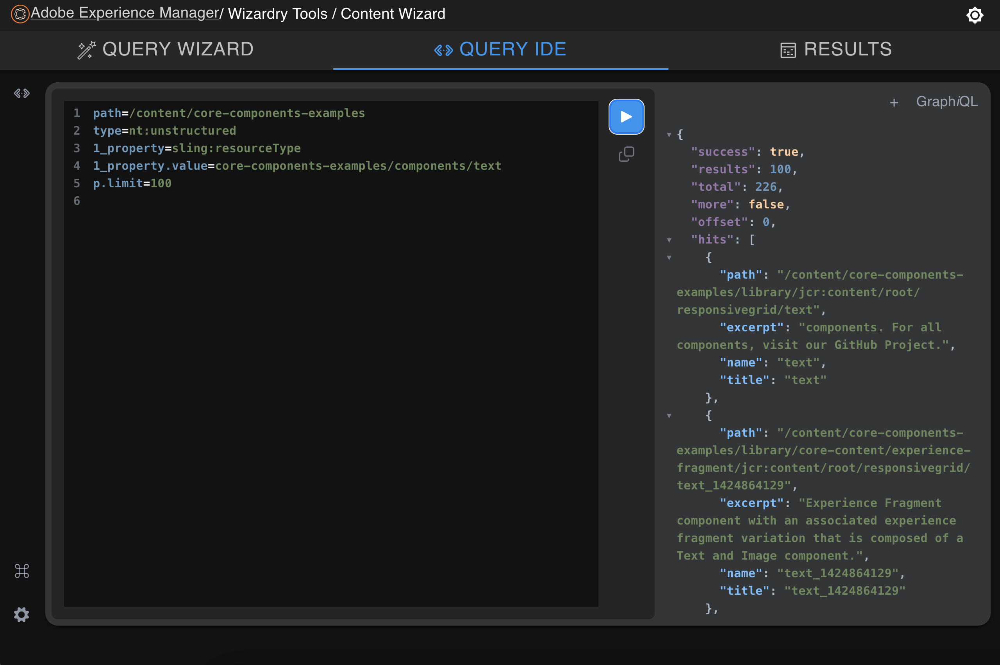
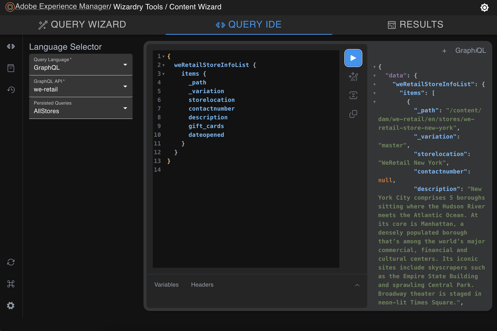
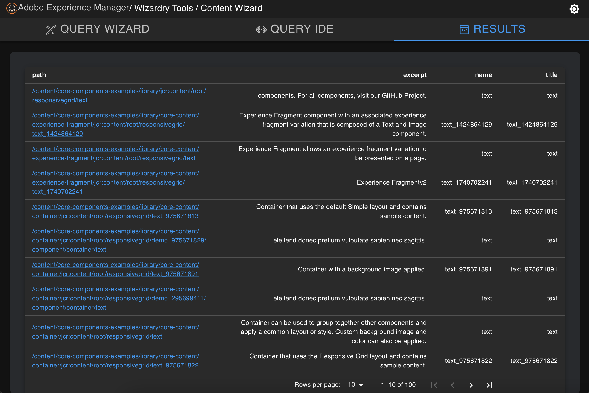

<!-- !toc (minlevel=2 omit="Table of Contents") -->

* [Quick Features](#quick-features)
  * [Query Wizard](#query-wizard)
  * [Query IDE](#query-ide)
  * [Results](#results)
* [Detailed Features](#detailed-features)
  * [Query Wizard Details](#query-wizard-details)
  * [Query IDE Details](#query-ide-details)
  * [Results Table Details](#results-table-details)
* [Project Structure](#project-structure)
  * [modules](#modules)
  * [How to build](#how-to-build)
  * [Local Development](#local-development)
    * [M2 Setup](#m2-setup)
  * [ClientLibs](#clientlibs)

<!-- toc! -->

# Wizardry Tools - Content Wizard
This is a Maven Project that builds and deploys a content scanning/reporting tool to an AEM Instance. The tool features
an easy to use QueryBuilder form, that will build QueryBuilder statements based on the user's input. This tool also 
features an advanced IDE for writing your own Query statements in 5 different languages supported by AEM. Any Results
returned by executed Query statements will render in a paginated table.

## Quick Features
### Query Wizard
Search AEM content with ease, as this user-friendly form lets you pick common conditions and customize the values.


### Query IDE
Adapted from the opensource [GraphiQL](https://github.com/graphql/graphiql), this is a flexible in-browser IDE that supports building/editing query statements in 5 different languages, with syntax highlighting.

The Query IDE retains the advanced GraphQL support that GraphiQL implemented, along with API & Persisted Query selection as additions.


### Results
All iterable results from executed query statements will appear on this tab in a paginated data table.


## Detailed Features

### Query Wizard Details

This mode is for AEM Content Users. It allows users to pick and choose various options to help build a functional QueryBuilder statement.

| Field Option   |                     |
|----------------|---------------------|
| Content Path   |                     |


  * Options:
    * Content Path: 
      * This is the path to the Content Tree where the Query should be performed
      * This has a user-defined value.
        ```
        path=/content/core-components-examples
        ``` 
    * Content Type:
      * This is the type of the content you wish to search for
      * This has a user-selected value.
      * options: [Page, XF, Asset, CF]
        ```
        type=cq:PageContent
        ```
    * Target Type:
      * This is the type that you wish to target your Query against. Helps filter down results beyond Content Type.
      * This has a user-selected value.
      * options: [None, Component, Template, Text]
        ```
        1_property=sling:resourceType
        ```
    * Target Resource Type:
      * This is a Sling Resource Type value. This is a full or relative path to a logical component identifier like 'wcm/core/components/text'.
      * When you have a Target Type of Component or Template selected, you can specify the Sling Resource Type for the Component or Template that you want to target in your query.
      * This has a user-defined value.
        ```
        1_property.value=wcm/core/components/text
        ```
    * Target Text:
      * This is a Full Text search against content matching the selected Content Type
      * This field requires a Target Type of Text
      * This has a user-defined value.
        ```
        fulltext=Hello World
        ```
    * Created By:
      * This allows you to filter Content based on who created it. Uses AEM Author usernames.
      * This has a user-defined value.
        ```
        2_property=jcr:content/jcr:createdBy
        2_property.value=admin
        ```
    * Last Modified By:
      * This allows you to filter Content based on who last edited the content. Uses AEM Author usernames.
      * This has a user-defined value.
        ```
        3_property=jcr:content/cq:lastModifiedBy
        4_property.value=admin
        ```
    * Last Replicated By:
      * This allows you to filter Content based on who last replicated the content. Uses AEM Author usernames.
      * This has a user-defined value.
        ```
        5_property=jcr:content/cq:lastReplicatedBy
        5_property.value=admin
        ```
    * Last Rolledout By:
      * This allows you to filter Content based on who last rolledout/synchronized to the Live-Copy content. Uses AEM Author usernames.
      * This field requires "is LiveCopy" to be enabled.
      * This has a user-defined value.
        ```
        6_property=jcr:content/cq:lastReplicatedBy
        6_property.value=admin
        ```
    * Created Date Range:
      * This allows you to filter Content by the date that it was created. You can supply one or both ends of the Date Range.
      * This has user selected date-time values.
        ```
        7_daterange.property=jcr:created
        7_daterange.lowerBound=2024-5-01T12:15:00
        7_daterange.upperBound=2024-6-01T12:15:00
        ```
    * Last Modified Date Range:
      * This allows you to filter content by the date that it was last modified/edited. You can supply one or both ends of the Date Range.
      * This has user selected date-time values.
        ```
        8_daterange.property=jcr:content/cq:lastModified
        8_daterange.lowerBound=2024-5-01T12:15:00
        8_daterange.upperBound=2024-6-01T12:15:00
        ```
    * Last Replicated Date Range:
      * This allows you to filter content by the date that it was last Activated or Deactivated. You can supply one or both ends of the Date Range.
      * This has user selected date-time values.
        ```
        9_daterange.property=jcr:content/cq:lastReplicated
        9_daterange.lowerBound=2024-5-01T12:15:00
        9_daterange.upperBound=2024-6-01T12:15:00
        ```
    * Last Rolledout Date Range:
      * This allows you to filter content by the date that it was last "rolled out to". This is based on the last time a Live-Copy was updated via Blueprint rollout (inheritance push) or Live-Copy synchronization (inheritance pull). You can supply one or both ends of the Date Range.
      * This has user selected date-time values.
      * ```
        10_daterange.property=jcr:content/cq:lastRolledout
        10_daterange.lowerBound=2024-5-01T12:15:00
        10_daterange.upperBound=2024-6-01T12:15:00
        ```
    * Is Published:
      * This filters for content that is published.
        ```
        11_property=jcr:content/cq:lastReplicationAction
        11_property.value=Activate
        ```
    * Is Unpublished:
      * This filters for content that has never been published.
        ```
        11_property=jcr:content/cq:lastReplicationAction
        11_property.operation=not
        ```
    * Is Deactivated:
      * This filters for content that is deactivated.
        ```
        11_property=jcr:content/cq:lastReplicationAction
        11_property.value=Deactivate
        ```
    * Is Blueprint:
      * This filters for content that does not have MSM Live-Copy properties
        ```
        12_property=jcr:content/jcr:mixinTypes
        12_property.operation=unequals
        12_property.value=cq:LiveSync
        ```
    * Is LiveCopy:
      * This filters for content that is designated as a MSM Live-Copy
        ```
        isLiveCopy=true
        ```
    * Is Suspended:
      * This filters for Live-Copy content that is suspended from rollouts.
        ```
        13_property=jcr:content/jcr:mixinTypes
        13_property.value=cq:LiveSyncCancelled
        ```
    * Has Cancelled Property Inheritance:
      * This filters to see if the Live-Copy content has cancelled any inherited properties.
        ```
        14_property=jcr:content/jcr:mixinTypes
        14_property.value=cq:PropertyLiveSyncCancelled
        ```
    * Inheritance Cancelled for Property:
      * This filters to see if the Live-Copy content has a specific property's inheritance cancelled.
      * This can be ran independently or together with the "Has Cancelled Property Inheritance" checkbox.
      * This has a user-defined value. 
        ```
        15_property=jcr:content/cq:propertyInheritanceCancelled
        15_property.value=pageTitle
        ```
    * Has Local Content:
      * Currently not supported.
    * Has MSM Ghosts:
      * This filters content by the sling:resourceType property, where the resourceType is `wcm/msm/components/ghost`.
      * TODO: Disable the Target Resource Type field if this checkbox is enabled.
        ```
        16_property=sling:resourceType
        16_property.value=wcm/msm/components/ghost
        ```
    * Is Language Copy:
      * This filters content that does not have AEM's translation source property. This property indicates the content was Language Copied in AEM. 
        ```
        17_property=jcr:content/cq:translationSourcePath
        17_property.operation=exists
        ```
    * Has Been Translated:
      * This filters the content that have been translated based on AEM's Translation framework.
        ```
        18_property=jcr:content/cq:translationStatus
        18_property.value=APPROVED
        ```
  * Advanced IDE
    * This mode is for Advanced Query users and features a browser-based IDE. It allows users to input raw query syntax based on supported AEM query languages.
    * The IDE can also be used to inspect the syntax of QueryBuilder statements built using the Query Wizard.
    * None of these language support WRITE operations on AEM and are only available as a means of retrieving information from AEM.
    * Supported Languages:
      * [QueryBuilder](https://experienceleague.adobe.com/en/docs/experience-manager-65/content/implementing/developing/platform/query-builder/querybuilder-predicate-reference)
        * AEM's native Query API. It's very powerful and customizable, but might be difficult to learn with limited AEM experience.
        * There are some features that have little to no documentations, such as the isLiveCopy predicate.
        * It is more powerful from a BE development perspective as it allows for complex logic to be built into custom Predicate Classes that can be deployed and reused natively across AEM.
      * [SQL](https://www.w3schools.com/sql/default.asp)
        * Not recommended as it's very weak compared to other options, but allows for simple queries with a popular query language.
        * SQL is a widely known language.
      * [JCR SQL 2](https://jackrabbit.apache.org/oak/docs/query/grammar-sql2.html)
        * The most powerful language in this context as it's the most flexible and operates at the JCR layer.
        * There are JCR native functions that provide contextual filtering capabilities beyond vanilla SQL. 
        * This also might be the easiest to use with limited AEM knowledge. See Referenced cheatsheet for more.
      * [XPATH](https://www.w3schools.com/xml/xpath_syntax.asp)
        * Since the JCR was designed to easily work with XML, it only makes sense that it supports an XML querying language.
        * It's not widely used, but has niche advantages for legacy applications. It's also a learning opportunities for folks that are curious.
        * The QueryBuilder API is heavily based on some XPATH capabilties, and therefore any QueryBuilder statement can directly translate into an XPATH statements. Visit your AEM's [Query Builder Debugger](/libs/cq/search/content/querydebug.html) to see this capability.
        * Additional [XPATH resources](https://devhints.io/xpath)
      * [GraphQL](https://graphql.org/)
        * GraphQL was introduced to AEM around the time that Content Fragments were introduced. It's a lightweight and dynamic Query API used for fetching Content Fragment from AEM, based on JSON.
        * Adobe added extra logic to support what's called "Persistent Queries", where someone can define a valid GraphQL statement that returns results, and then store that statement in AEM making it accessible from a custom endpoint. The Persisted Queries improve performance and re-usability as well as providing additional caching strategies.  
        * GraphQL has to be setup first on AEM before it can be fully utilized. If you are just playing around or don't have a project that uses GraphQL or Content Fragments, you can simply install the `we.retail` code and content, provided by AEM OOTB, and then setup the GraphQL endpoints for `we.retail`.
        * An "Introspection Query" must be performed against a GraphQL endpoint before it's schema is "known" by the IDE and able to provide contextual GraphQL support.
        * Additional [GraphQL resources](https://experienceleague.adobe.com/en/docs/experience-manager-learn/getting-started-with-aem-headless/overview)
    * Only use this mode if you know what you are doing. Syntax is not currently being validated. You could cause performance issues on your environment.
    * [Query Cheatsheet for AEM](https://experienceleague.adobe.com/docs/experience-manager-65/assets/JCR_query_cheatsheet-v1.1.pdf?lang=en)
  * Additional IDE Features:
    * Has Query Storage that will store any queries entered into the IDE making them accessible for future sessions in the IDE.
      * TODO: Need to improve the storage mechanism to support Query Objects instead of just Query Statements. There may be bugs with Non-GraphQL languages being stored.
    * Has the ability to persist Headers for GraphQL requests.
    * Has the ability to inject variables for GraphQL requests.
    * Has a Document Explorer for GraphQL Schema Objects.
    * Has a Copy query button
    * Can Prettify GraphQL Statements
      * TODO: add support for other Languages to be prettified.
    * Can support multiple "Tabs" for different Query Statements
      * TODO: add logic to distinguish session "Tabs" based on their Query Language. Currently, it's mixed and doesn't change IDE Language support when choosing a "Tab" with a statement from a different language.
    * Has syntax highlighting for GraphQL and SQL. Mild support for JCR_SQL2 and QueryBuilder.
      * TODO: improve codemirror language support for JCR_SQL2, QueryBuilder, and XPATH.
    * Has its own execution/run button for Queries.
    * Can be used to inspect QueryBuilder statements that are built by the Query Wizard.
    * Can display raw JSON results for the executions.
    * Allows the user to toggle Dark Mode across the entire application. This setting gets persisted into local browser storage.


### Query IDE Details


### Results Table Details

* When a query is executed, if any Results are returned, they will be populated in a Table on the Results tab.
* The Results table features Pagination where you can define how many results "per page" get displayed.
  * TODO: Need to inform the UI when user updates the pagination option, so that the page becomes scrollable when the results spill out the viewport.

## TODO FEATURES:

* Add User Input sanitization.
* Expand Results Exporting capabilities
  * Create Content Package
  * Send Email?
* Add Results Management Capabilities:
  * Activate/Deactivate results
  * Run AEM Workflow against results
  * MSM and Translation activities?
* Add Results Bulk Editing Capabilities:
  * Delete property from Results
  * Delete Content Node on Results
  * Add Property to Results
  * Add Content Node on Results
  * Update Property on Results
  * Move/Rename Property on Results
  * Move/Rename Content Node on Results


## Project Structure
### Modules

* ui.apps: Contains a basic app page and the Client Library for the Content Wizard.
* ui.content: contains the content that defines the app page in AEM and makes it accessible in the Tool Navigation.
* ui.config: contains runmode specific OSGi configs for the project (this is installed with the optional `localDev` maven profile during build time)
* [ui.frontend:](ui.frontend/README.md) a dedicated front-end build mechanism (React + Typescript + Webpack + SCSS)
* all: a single content package that embeds all the compiled modules zips and is deployed to AEM.

### How to build

To build all the modules run in the project root directory the following command with Maven 3:

    mvn clean install

To build all the modules and deploy the `all` package to a local instance of AEM, run in the project root directory the following command:

    mvn clean install -PautoInstallSinglePackage


Or to deploy only a single content package, run in the sub-module directory (i.e `ui.apps`)

    mvn clean install -PautoInstallPackage

Note: When building with Maven from the project root, the Maven build will automatically checkout and install a project-scoped version of Node 18 and use it to build the `ui.frontend` module.


### Local Development

If you intend on doing any local development or testing with this tool, include the `localDev` maven Profile. This will setup the required CORS policy.

    mvn clean install -PautoInstallSinglePackage,localDev

Note: If you swap between adding and removing the `localDev` profile, you may have to manually re-install project packages via [CRX PackageManager](/crx/packmgr/index.jsp)

Note: Just refer to the We.Retail content for local dev/testing... Or your own content.

#### M2 Setup

You need you have a settings.xml file defined @ ~/.m2 which configures your connection to a Maven Repository. It is required to build this entire project locally with Maven. More info [here](https://www.baeldung.com/maven-settings-xml).


### ClientLibs

The frontend module is made available using an [AEM ClientLib](https://helpx.adobe.com/experience-manager/6-5/sites/developing/using/clientlibs.html). When executing the NPM build script, the app is built and the [`aem-clientlib-generator`](https://github.com/wcm-io-frontend/aem-clientlib-generator) package takes the resulting build output and transforms it into such a ClientLib.

A ClientLib will consist of the following files and directories:

- `css/`: CSS files which can be requested in the HTML
- `css.txt` (tells AEM the order and names of files in `css/` so they can be merged)
- `js/`: JavaScript files which can be requested in the HTML
- `js.txt` (tells AEM the order and names of files in `js/` so they can be merged
- `resources/`: Source maps, non-entrypoint code chunks (resulting from code splitting), static assets (e.g. icons), etc.
